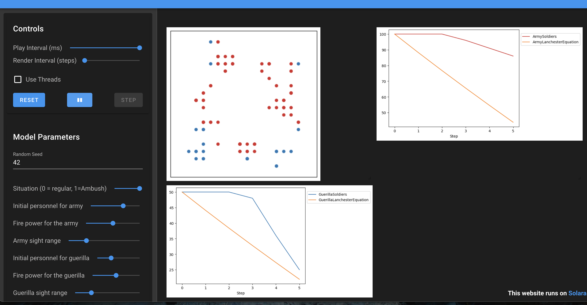

# Guerilla Warfare Agent-Based Model



I did a little while ago a research work on the modeling of a guerilla warfare. The paper I ended up coming with is a theoretical approach to something that can be modeled by ABM. What I am quite interested in is verifying the classical Lanchester equations that are supposed to rule this type of battle, as well as the modified asymmetric model (Deitchman adaptation).

I chose to use the [mesa framework](https://github.com/projectmesa/mesa) to implement it, as it is handy and has a lot of interesting features that can be of use for this project.

Overall, the model simulates combat between two forces: a conventional Army and a Guerilla force. It supports two engagement scenarios:
- **Classic warfare**: Forces face each other in traditional battle lines
- **Ambush**: Guerilla forces encircle and attack the conventional forces


#### Table of content
- [Installation and Usage](#installation-and-usage)
- [Theoretical Background](#theoretical-background)
- [Model and agent behavior](#Model-and-agent-behavior)
- [Next steps](#Next-steps)
- [References](#references)


## Installation and Usage

1. Ensure you have Mesa installed + download the github repo:
```bash
   make install           
```

the structure for your folders should be the following
   
```
   ├── ABM_mesa_models/
   │    └── Guerilla/
   │        └── ...
   ├── mesa/

```

2. Run the application:
```bash
   solara run app.py #or make run
```

3. Adjust parameters via the web interface sliders:
   - Set initial force sizes
   - Adjust firepower and sight ranges
   - Switch between Classic and Ambush scenarios


4. Visualization :
   - Red circles represent Army soldiers
   - Blue circles represent Guerilla soldiers
   - The grid shows current positions and movements
   - Plots track the population of each force over time


## Theoretical Background

The objective of this model is to implement and compare two mathematical warfare models:

| Aspect                 | Classical Engagement                            | Ambush Engagement                                 |
|------------------------|--------------------------------------------------|--------------------------------------------------|
| Visibility             | Mutual visibility                                | Guerrillas are hidden; defenders are exposed      |
| Governing Equations    | dx₁/dt = -a·x₂  <br> dx₂/dt = -b·x₁              | dx₁/dt = -A·x₂·x₁  <br> dx₂/dt = -b·x₁             |
| Required Superiority   | Global numerical and firepower advantage         | Local superiority and tactical advantage          |
| Likely Outcome         | Side with more numbers or firepower wins         | Guerrillas can win despite being outnumbered      |

Although I set the slider to a wider range of choices for experimentations, I recommand to choose the parameters as described in here for better result.


This is based on my previous work on [Modeling Guerilla Warfare](Guerilla_Reaseach_Paper_ColinFRISCH.pdf), and documentation include Lanchester and Deitchman research papers (cf. references).

## Model and agent behavior

#### Classic Warfare
- Forces are placed on opposite sides of the grid
- Both sides have equal visibility and engagement capabilities
- Outcome typically favors the larger or more powerful army

#### Ambush
- Army forces are placed in the center of the grid
- Guerilla forces are placed around the perimeter
- This scenario tests the asymmetric warfare model where smaller forces can prevail through tactical advantage (adjusted parameters)

#### Agent Behavior

Each soldier agent follows a simple decision process:
1. Find the closest enemy
2. If enemy is within sight range : Shoot at the enemy and kill him with the probability defined by fire_power
3. If no enemy is within sight range : Move toward the closest enemy 

Movement uses a Manhattan distance calculation to determine the closest enemy, followed by a directional vector to choose the best neighboring cell for movement.


## Next steps
- Add continous space
- Add terrain
- Add communication between soldiers (to modify firepower and sight)
- As a followup to the communication feature, add an LLM-based strategy feature for the soldiers


## References

- Lanchester, F. W. (1916). *Aircraft in Warfare: The Dawn of the Fourth Arm*
- Deitchman, S. J. (1962). *A Lanchester Model of Guerrilla Warfare*. Operations Research, 10(6), 818–827
