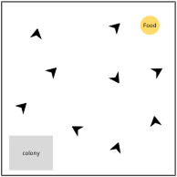
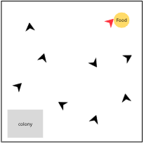
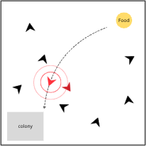
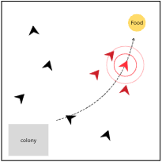
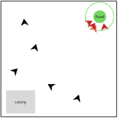

# Foraging Ants Simulation

## Concept
Model a colony of ants searching for food. Each ant uses its memory to remember the locations where food was previously found and is able to transmit the information to the other ants on its path.

## Implementation:

The environment is a continuous grid representing the terrain with scattered food sources (number of food sources : initial_food).​

#### Agents: 
**Ants** : Represented by an arrow, we want to see how much food they can gather. They have a memory capacity to store recent food source locations.​ Ants forget the oldest memories when their memory capacity is exceeded.
**Food** : (allways constant number in the grid). Spawns randomly, is eaten when enough ants gather around it (ants_needed). When eaten, disapears and a new food agent spawns elsewhere.

## Unfolding

Ants explore the grid randomly.​ 

Upon finding food, the ant :
1. Stores the location in their memory and goes to the colony - does not eat the food.
2. On the way back, transmits the information to all ants physically close to them.
3. When arrived in the colony, they go back to the food source, continuing the transmition
4. When arrived back at the food source : ant stays there, continues transmitting and waits there until enough ants are present and the food is eaten

   

## Technical considerations

Model made to test the Memory feature, it uses :
- memory.remember(entry, entry_type, external(optionnal) )
- memory.get_by_type(entry_type)
- memory.forget(entry_id)
- memory.tell_to(external_agent, entry_id)

Non tested : memory.recall(entry_id)

## Next steps

- Ants can recieve many communications that indicate the position of food and directly go from a food to another

